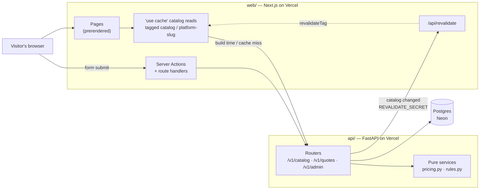

# Architecture

How TruckBuild is put together, and why it is put together that way. For the choices themselves and
the ones deliberately rejected, see [decisions.md](decisions.md); for the vocabulary, see
[domain-model.md](domain-model.md).

## The shape of it

Two services, no monorepo tooling tying them together. Each is installed, run, tested, and deployed
from its own directory.

| | `web/` | `api/` |
|---|---|---|
| Stack | Next.js 16 (App Router), TypeScript, Tailwind 4 | FastAPI, SQLModel, Alembic |
| Package manager | pnpm | uv |
| Owns | Presentation, the configurator UI, lead forms | The catalog, authoritative pricing, quotes, admin |
| Talks to | The API, server-side only | Postgres, and the web app's revalidation hook |



The dotted line is the important one. Pages do not call the API per request; they read from cache,
and the API pushes an invalidation when the underlying rows change.

## The central tension, and how it is resolved

FastAPI owning the catalog conflicts with a marketing site's need for fast, prerendered,
SEO-indexable pages. Nearly every structural decision below falls out of resolving that.

**Next.js 16 Cache Components.** `cacheComponents: true` in `web/next.config.ts` enables partial
prerendering, and every catalog read lives inside a `'use cache'` function in
`web/src/lib/catalog.ts`:

```ts
export async function getCatalog(): Promise<Catalog> {
  "use cache";
  cacheLife("hours");
  cacheTag("catalog");
  return fetchCatalog();
}
```

Pages render from that cache rather than from a live call, which buys three things at once: pages are
fast, they are indexable, and **a slow or down API does not take the marketing site with it**.

> If `pnpm build` stops printing `- Cache Components enabled`, every assumption on this page is void.
> That line is the check, not the config file.

**Invalidation, not expiry.** When catalog rows change, FastAPI POSTs to the web app's
`/api/revalidate` with a shared `REVALIDATE_SECRET`; the route calls `revalidateTag`. Editors get
near-immediate updates without the site paying a per-request API cost. The tags are `catalog` and
`platform-<slug>`, so a single platform edit does not evict everything.

**YAML as versioned content, Postgres as runtime truth.** `api/seed/catalog.yaml` is the reviewable,
version-controlled source; `app/seed.py` upserts it by slug, so re-running is always safe. Postgres
remains what the API reads. This is also the seam a CMS would later plug into.

## The rules

TruckBuild is a **modular monolith**: one process, one database, one deployable. The module
boundaries inside `api/app/modules/` are drawn where a service boundary would go if this ever
needed to split — nothing under `modules/` is deployed separately, on purpose, so a boundary can
be tightened in code long before it costs an actual network hop.

These are load-bearing. Breaking one does not fail loudly, which is why each is checked by a
specific tool rather than trusted to review.

| Rule | What it means | Checked by |
|---|---|---|
| Layers inside a module | `presentation → infrastructure → application → domain`, arrows one way. The two adapters (`presentation`, `infrastructure`) are siblings and neither imports the other | `uv run lint-imports` (`api/pyproject.toml`) |
| Module direction | `admin → quotes → catalog → core`, a DAG. `core` imports no module, ever | `uv run lint-imports` |
| Facades | Another module sees only your `application` and `domain` — never your `presentation` or `infrastructure`. Test: *if this module went behind an HTTP call tomorrow, would this import still make sense?* | `uv run lint-imports` |
| A domain imports no ORM | `app/modules/*/domain/` and `app/core/domain/` name no `sqlmodel`, no `fastapi` | `uv run lint-imports` (`Domain forbids persistence`) |
| A presentation writes no query | No router imports a repository directly — every query happens behind `application` | `uv run lint-imports` (`Presentation forbids persistence`) |
| The pricing mirror is pure | `catalog/domain/pricing.py`, `catalog/domain/rules.py` name no `fastapi`, no `sqlmodel` | `uv run lint-imports` (`Pricing mirror purity`) |
| Every port is bound | Each `presentation` declares what it needs as a function that raises `NotImplementedError`; `app/main.py`'s `PORT_BINDINGS` fills every one | `tests/test_composition_root.py` |

Four more rules, checked less mechanically but just as real:

**The pricing mirror is deliberate duplication.** `price_build` exists in Python
(`catalog/domain/pricing.py`, authoritative) and in TypeScript (`web/src/lib/pricing.ts`, instant
UI feedback). Both are tested against **one shared fixture**, `fixtures/pricing-cases.json` — the
only thing keeping them from drifting.

**The server price is authoritative.** `POST /v1/quotes` re-validates the selection and
recomputes the total, ignoring any client-supplied price.

**The browser never sees the API origin.** `API_BASE_URL` is server-side only, never prefixed
`NEXT_PUBLIC_`. The browser reaches FastAPI only through Server Actions and route handlers.

**Slugs are the public identifiers.** They appear in URLs and shared builds. Renaming one is a
breaking change.

Two more, about how the two services talk to data:

**Every backend response is parsed with Zod**, in `web/src/lib/contract.ts`, rather than cast — a
backend shape change surfaces as a named field error at the boundary instead of a runtime
`undefined` three components deep.

**Every environment variable is declared in `app/core/config.py`** (pydantic-settings), so a
missing or malformed value fails at startup rather than deep inside a request.

## Adding a module

A new feature module is twelve files, built in dependency order — each layer only needs what
came before it:

1. `domain/models.py` — pure pydantic entities, on `core`'s `BaseEntity`
2. `domain/interfaces.py` — this module's ports (an `I<Name>Repository` at minimum)
3. `domain/filters.py` — a `BaseFilter` subclass per queryable entity
4. `infrastructure/postgres/tables.py` — the SQLModel tables, `__tablename__` pinned
5. `infrastructure/postgres/mappers.py` — table ↔ domain, assembled from already-loaded rows
6. `infrastructure/postgres/repositories.py` — the port's Postgres implementation
7. `application/dtos.py` — request/response shapes
8. `application/mappers.py` — domain ↔ DTO
9. `application/use_cases.py` — one class per operation, overriding `BaseUseCase` hooks
10. `application/services.py` — the module's facade: wires use cases together for its router
11. `dependencies.py` — this module's own composition root, binding its ports to step 6 and 10
12. `presentation/<name>_api.py` — the router; declares any port it needs from *another* module
    as a function that raises `NotImplementedError`

Then four wiring points, none of them inside the twelve files above:

- **`app/main.py`** — mount the new router, and if `presentation/<name>_api.py` declared a port
  onto another module, add it to `PORT_BINDINGS`
- **The module's own `dependencies.py`** (file 11) — already built with the module, but worth
  naming separately: it's the one file allowed to see both an adapter and an inner layer
- **`SQLModel.metadata`, via the table import** — a new `tables.py` has to be reached by
  `alembic/env.py`'s import list, or autogenerate never sees it (`tests/test_entity_registry.py`
  fails if it's missed)
- **An Alembic migration** — see the `alembic-migration` skill

`tests/test_composition_root.py` fails if a declared port is left unbound; `uv run lint-imports`
fails if a layer or facade rule is broken. Both run in CI, so a half-wired module fails fast
rather than as a 500 on the one endpoint nobody exercised in review. See also the `new-module`
skill, which walks this same checklist.

## Build state lives in the URL

A build is a platform plus a set of selected option slugs, encoded in the query string as
`?o=slug-a,slug-b`. `web/src/lib/build.ts` owns the encoding.

That choice gives shareable, refresh-safe, back-button-correct builds with no database round trip and
no session. The cost is that the query string is untrusted input, so **decoding repairs rather than
throws** — a shared URL outlives the catalog it was built from:

| The URL says | `decodeSelection` does |
|---|---|
| An option that no longer exists | Drops it |
| Two options from a `single`-select group | Keeps the first named |
| Nothing for a `required` group | Falls back to that group's first option |
| A combination that violates a rule | **Keeps it** |

That last row is the interesting one. A conflicting selection is preserved on purpose, because the
configurator can explain a conflict inline — and cannot explain a choice it silently discarded.

The URL is written with `history.replaceState`, not a router navigation, so configuring does not push
a history entry per click.

## Route groups

Marketing pages live under `web/src/app/(site)/`, whose layout carries `Header` and `Footer`. The root
layout holds only the document shell.

`/configurator/[slug]` sits **outside** that group deliberately: it is full-bleed with its own minimal
bar, and a nested layout cannot remove a parent's chrome. Route groups add no URL segment, so paths
are unaffected.

## The request path for a lead

The one flow that crosses every boundary:

1. The visitor configures a build; `pricing.ts` updates the total on each click, locally.
2. They submit the form. A **Server Action** (`web/src/lib/actions.ts`) receives it — the browser
   never learns the API origin.
3. The action forwards to `POST /v1/quotes`, passing the visitor's `x-forwarded-for` so rate limiting
   buckets by visitor rather than putting every submission in the world in one bucket.
4. FastAPI re-validates: unknown slugs, single-select groups with two choices, required groups with
   none, and every `requires`/`excludes` rule.
5. It **recomputes the price** from the database and stores that, not what the client sent.
6. It generates a reference (`TB-XXXXXX`), retrying on the unique-index collision rather than hoping.
7. The mailer notifies sales — or logs, when `RESEND_API_KEY` is unset.
8. The visitor lands on `/thank-you` with the reference number.

Rejections all come back in one error shape (`api/app/core/presentation/errors.py`), FastAPI's own 422 included, so the
web app has a single body to parse and render beside the field at fault.

## Observability

| Concern | Mechanism |
|---|---|
| Page analytics | `@vercel/analytics` + `@vercel/speed-insights` — first-party, so no third party sees the visitor |
| API errors | Sentry, active only when `SENTRY_DSN` is set, layered over always-on structured JSON request logs |
| Web errors | `onRequestError` server-side; `global-error.tsx` → `/api/client-error` client-side |
| Correlation | One `X-Request-ID` per request, forwarded across the service hop and returned to the caller |

Two points worth stating, because the cheaper version of each looks identical until it matters:

- **Structured logs are the floor, not the fallback.** They cost nothing, belong to no vendor, and
  keep working when Sentry is off, misconfigured, or rate-limited — which is every environment except
  production. Sentry is the layer on top.
- **Lead data never reaches Sentry.** A quote body carries a name, an email, and a phone number. The
  `before_send` scrubber in `telemetry.py` drops the request body, cookies, and credential headers,
  and it is the most heavily tested code in that module, because a mistake in it is invisible until
  after it has shipped.

Middleware order in `app/main.py` is load-bearing and counter-intuitive: `add_middleware` inserts at
position 0 and the stack is built by wrapping in reverse, so **the last one added is the outermost**.
Telemetry is added last so it stamps the request id before anything else can fail.

## Security posture

- **Admin is a single bearer token**, compared with `compare_digest`. Deliberately minimal for two or
  three people reading leads; the upgrade path is real accounts. The guard is on the *router*, so a
  route added there is protected by construction rather than by the author remembering.
- **Lead forms** carry a honeypot field, a minimum time-to-submit, and a per-IP rate limit. All three
  are tuned generously: turning away a real customer costs more than storing a junk lead.
- **`/api/client-error`** is necessarily unauthenticated — it is called by a page that has just
  crashed — so it caps the body, keeps only known fields, and answers 204 to everything.
- **Security headers** are set in `next.config.ts`: `nosniff`, `X-Frame-Options: DENY`,
  `frame-ancestors 'none'`, a referrer policy that does not leak a configured build to outbound links,
  a `Permissions-Policy` denying everything unused, and HSTS.

## Where things live

```
api/
  app/
    main.py             composition root — mounts each module's router, binds every port
    seed.py             thin CLI: reads catalog.yaml, calls catalog's SeedCatalogUseCase
    core/                shared kernel, its own four layers — imports no module
      config.py          every env var declared, read by every layer, belongs to none
      domain/            BaseEntity · IBaseRepository · IRateLimiter · BaseFilter · BaseError
      application/        BaseUseCase + CRUD subclasses · BaseService · BaseMapper
      infrastructure/     BaseTable · BaseRepositoryPostgres · engine & session · ratelimit
      presentation/       create_app · exception handlers · telemetry · query filters
    modules/
      catalog/           platforms · option groups · options · rules · assets
        domain/           models.py (pure) · interfaces.py · filters.py · pricing.py · rules.py
        infrastructure/    postgres/ (tables · mappers · repositories, incl. the seed upsert)
                           catalog_file.py (YAML read) · webhook/revalidate.py
        application/       dtos.py · mappers.py · use_cases.py · services.py
        presentation/      catalog_api.py · filters.py
        dependencies.py    binds this module's ports to its adapters
      quotes/            lead submission, priced by the server
        domain/           models.py · interfaces.py · filters.py · refs.py · spam.py · selection.py
        infrastructure/    postgres/ (tables · mappers · repositories) · mail.py
        application/       dtos.py · mappers.py · use_cases.py · services.py · interfaces.py
        presentation/      quotes_api.py · routes.py
        dependencies.py
      admin/             guarded reads over quotes and catalog — owns no tables
        application/       dtos.py · use_cases.py · mappers.py
        presentation/       admin_api.py · dependencies.py · filters.py · routes.py
  seed/catalog.yaml   versioned catalog content
  alembic/            migrations

web/src/
  app/(site)/          marketing pages, with Header + Footer
  app/configurator/     full-bleed, outside the (site) group
  app/api/              revalidate · client-error
  components/           configurator/ · leads/ · shared
  lib/
    contract.ts   Zod schemas + wire types      api.ts       transport: fetch, parse, POST
    catalog.ts    'use cache' reads              build.ts     URL build encoding
    buildView.ts  shared build derivation        pricing.ts  ← mirrors pricing.py
    rules.ts      ← mirrors rules.py             format.ts   money formatting (Intl)
    actions.ts    Server Actions                 leads.ts    form ↔ payload
    purposes.ts   editorial verticals            site.ts     SITE_URL, nav, footer
```

`purposes.ts` is worth a note: purpose verticals (Expedition, Service, Response) are **editorial
framing over the catalog, not a backend entity**. Each names a `platformSlug` looked up from FastAPI
at request time. One purpose maps to one platform today; the model allows more without a page rewrite.
